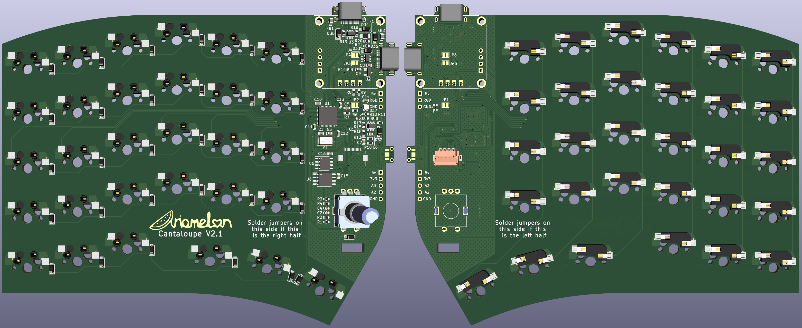
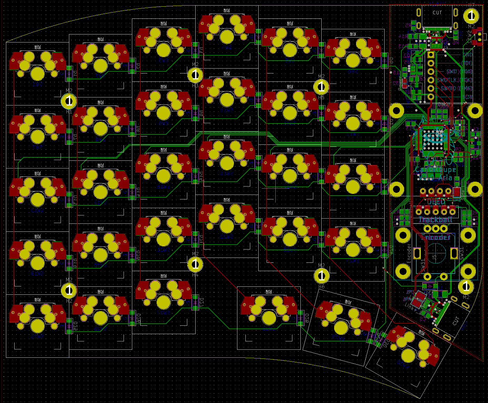
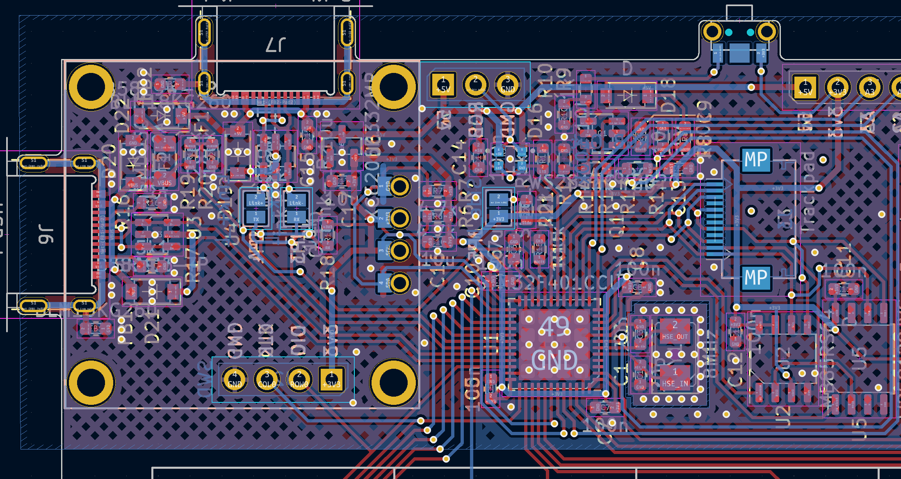
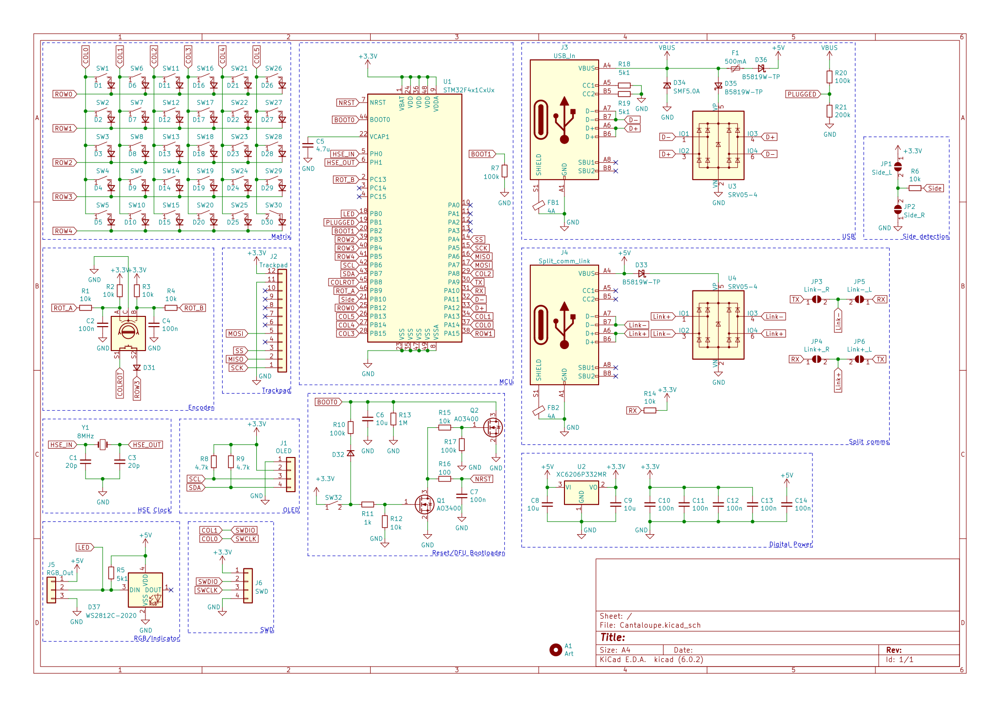

# Cantaloupe
~60% 60-key QMK-compatible split ergonomic keyboard.

## Disclaimer
The layout is based on the [Ergodash](https://github.com/omkbd/ErgoDash) layout with the inner-most keys removed and an improved thumb cluster. The layout was only used as a reference, nothing was copied and the board is a completely new design. In addition, design cues from the [YAEMK](https://karlk90.github.io/yaemk-split-kb/) were used in this design, and plenty of help was gotten from various members in the QMK discord server (thanks guys!).

## Key Features
* Ergonomic 30-key layout including pinky stagger and arrow keys.
* MX switch support with kailh hot-swap sockets.
* 100% reversible design which means only a single board is needed for both sides.
* 0.96" 128x64 SSD1306 OLED support.
* Two rotary encoders supported above the thumb cluster, one on each side.
* Support for the cirque 35mm trackpad modules is also available, replacing one rotary encoder slot per side.
* On-board ARM STM32F401CCU6 processor.
* USB-C input and split connect ports with full ESD protection.
* SWD breakout header for an alternate means of programming the board.
* On board RGB LED for signaling, as well as an external RGB header in case underglow is desired.
* Additional header for external use of pins A2 and A3.

## Changelog
* 26/5/2022: Fixed mistakes with bottom cases. Added piece which is meant to mate with the button, allowing the reset to be pressed without needing a screwdriver. Update to USB port name and footprint (no functional change). Updated pin assignments. Rerouted board.
* 24/5/2022: Changed the matrix diodes to dual MMBD4148ACC diodes. Swapped ROW1 and COL0 pins. Fixed minor issue with case models. Updated BOM. Added LCSC part names to all parts on schematic.
* 23/5/2022: Updated trackpad plate models. Fixed OLED silk. 
* 22/5/2022: Added footprints for SPI FRAM/EEPROM and flash memory. Added breakout header to expose some unused pins. Fixed 3D models for plate pot. Updated 3D model for the EC11. Changed the two AO3400s to a AO6802 dual NMOS. Replaced switch with a more durable version that's the same size while keeping the footprint compatible with the previous switch. Updated BOM.
* 21/5/2022: Revised schematic. Switched trackpad to SPI interface and moved header. Moved location of OLED screen and changed footprint. Changed indicator LED to a small RGB one, and added an RGB header. Moved USB ports and reset button. Much better revised cases. Slightly increased horizontal size to fully accommodate the Cirque TM35035. Added lots of 3D models for all the footprints. Removed V1 as that was no longer being updated.
* 15/5/2022: V2.1 version updates. Removed silkscreen jumper guides, pimoroni trackball header and plate for trackpad. Updated BOM.
* 14/5/2022: Added silkscreen jumper guides. Connected indicator LED to spare GPIO. Updated images. Added optional I2C resistors. New logo. New plate CAD files for potentiometer, trackball and trackpad options. Added header for Cirque trackpad. Cleaned up footprint library.
* 13/5/2022: Updated firmware. Added custom graphic to OLED display. Updated 3DP case and BOM. Removed CNC case. Fixed error with silkscreen. Added silkscreen jumper guides.
* 15/2/2022: Revised 3DP and CNC case designs.
* 13/2/2022: Added tentative designs for CNC and 3D printed cases. 
* 11/2/2022: Clean up of design. New images. Added gerbers and files for FR4 plates.
* 9/2/2022: Changed pin assignments so B2 isn't used. Added pull-up for RX pin and pull-down for B2 pin so the keyboard can properly load into the bootloader. Changed reset circuit so it actually works. Removed USB series resistors. Removed non-functional JTAG pins. Changed SRV05-04 to SRV0504. Thanks to sigprof and MasterSpoon from the QMK discord server for the help!
* 8/2/2022: Removed holes in middle of PCB. Added top and bottom plate DXF files, as well as a tentative STEP file for a CNC case. 
* 25/1/2022: Did some rerouting, increased clearances and via size.
* 21/1/2022: Changed CPU to STM32F401CCU6 (lets me steal them from Black Pill boards). Added plate and base gerber files. Changed BOM to reflect changes.
* 20/1/2022: Cleaned up read-me. Rearranged location of mounting holes and changed size of holes. Rerouted some traces. Cleaned up silkscreen. Added DXF files for plate and base. Changed images. Added BOM.
* 19/1/2022: New V2.0 version. On-board ARM STM32F303 processor, kailh hot-swap, ESD protection, 0.96" OLED, trackball and rotary encoder. 100% reversible design which means only a single board is needed for both sides. Plenty of design cues taken from the YAEMK. Pinky stagger added.
* 6/12/2021: Updated to V1.5. Added the option for OLED again. Removed Alps support. Improved switch footprints. Removed 2u support and moved rotary encoder positions. Deleted 61st and 62nd keyswitches - now has exactly 30 switches per side. Changed USB C interconnect back to TRRS and moved position.
* 1/10/2021: Added SMK support again (I'm indecisive).
* 20/7/2021: Updated to V1.4. Removed OLED support, as I don't actually care about OLED and haven't been using it with the previous prototype for a while.
* 17/5/2021: Fixed BOM and added proper OLED support.
* 2/12/2020: Changed orientation of 1u switches in thumb cluster. Updated plate to add 2u support.
* 1/12/2020: Changed OLED compatibility to 0.96" OLED. Removed Crenshaw compatibility. Removed large cutout in plate for pro micro and Crenshaw, added smaller cutout just showing screen of 0.96" OLED.
* 29/11/2020: Updated to V1.3. Added 2u switch locations in outer bottom corners and thumb cluster. Slightly increased size to allow for high-profile case options. Changed mounting holes on PCB to pass-through holes to allow for direct top and bottom plate mounting. Removed SMK switch support. Updated plate to add Alps compatibility.
* 14/11/2020: Changed USB C connector to normal from mid-mount.
* 11/11/2020: Updated to V1.2. Switch footprints changed to solder holes, compatible with MX, Alps and SMK switches. 5-way switch removed. Pro Micros flipped, facing downward, to reduce overall thickness of keyboard. Diode footprints changed to allow use of both TH and SMD (SOD-123(F) and glass DO-35) diodes.
* 7/11/2020: Fixed position of RHS screw hole and wiring of rotary encoder switch, added QMK firmware.
* 28/10/2020: Better photo, reorganized footprints, minor fixes to circuit.
* 25/10/2020: Added back 5-way switch. Removed SMK support. New renders.
* 24/10/2020: Updated to V1.1. Slightly increased stagger and different PCB shape based on the [Galia](https://github.com/Ariamelon/Galia), removed snap-away interconnect section of PCB, added ICSP header. Moved location of images folder.
* 28/09/2020: Added case files.
* 27/09/2020: Initial commit.