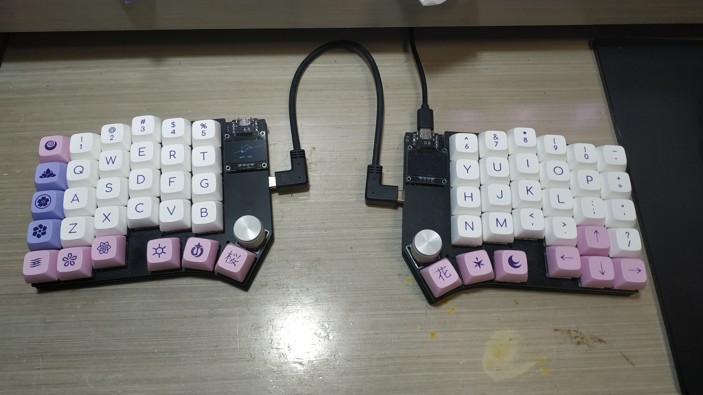

# Cantaloupe
~60% QMK-compatible split ergonomic keyboard with two versions.

## Disclaimer
The layout is based on the [Ergodash](https://github.com/omkbd/ErgoDash) layout with the inner-most keys removed and an improved thumb cluster. The layout was only used as a reference, nothing was copied and the board is a completely new design. In addition, many design cues from the [YAEMK](https://karlk90.github.io/yaemk-split-kb/) were used in this design.

## Key Features
* Ergonomic 30-key layout including pinky stagger and arrow keys.
* MX switches with kailh hot-swap sockets.
* 100% reversible design which means only a single board is needed for both sides.
* 0.96" 128x64 SSD1306 OLED support.
* Two rotary encoders supported above the thumb cluster, one on each side.
* Support for the Pimoroni trackball module is also available, replacing one rotary encoder slot.
* Both versions support the same plates.

