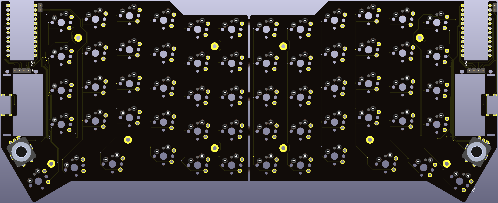
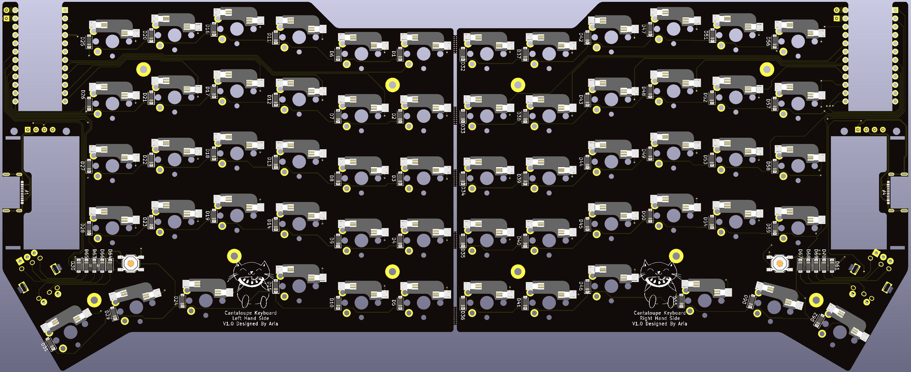

# Cantaloupe
60-Key Hot-Swappable Split Ergo Keyboard

## Disclaimer
The layout is based on the [Ergodash](https://github.com/omkbd/ErgoDash) layout with the inner-most keys removed and an improved thumb cluster. The Pro Micro position was also moved inwards to allow for a thinner board. The layout was only used as a reference, nothing was copied and the board is a completely new design.

## Key Features
* Slim design, or as slim as I could get while using standard MX-style Switches. Essentially, the Pro Micro or whatever mounts under the PCB, flush and facing up with the help of a cutout.
* SMK MX-style switch support, solder only but the holes are mill-max socket compatible.
* OLED support, either using a standard 0.91" SSD1306 OLED or the [Crenshaw](https://github.com/Ariamelon/Crenshaw) 1.3" OLED breakout board made by me.
* Up to two rotary encoders or 5-way switches supported in the thumb cluster, one on each side.
* 601230 LiPo support with the interconnect receptacle or 802030 without.
* The part of the board with the interconnect is removeable if it isn't wanted, just snap it away.
