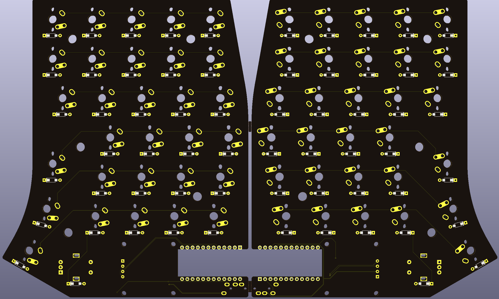

# Cantaloupe
~60% QMK-compatible Split Ergonomic Keyboard

## Disclaimer
The layout is based on the [Ergodash](https://github.com/omkbd/ErgoDash) layout with the inner-most keys removed and an improved thumb cluster. The Pro Micro position was also moved inwards to allow for a thinner board. The layout was only used as a reference, nothing was copied and the board is a completely new design.

## Key Features
* Slim design, or as slim as I could get while using standard MX-style Switches. Essentially, the Pro Micro or whatever mounts under the PCB, flush and facing up with the help of a cutout.
* MX and Alps switches supported.
* 0.96" SSD1306 OLED supported.
* Up to two rotary encoders supported in the thumb cluster, one on each side.
* 301230 LiPo support under pro micro and on-board hard switch.

## Changelog
* 27/09/2020: Initial commit.
* 28/09/2020: Added case files.
* 24/10/2020: Updated to V1.1. Slightly increased stagger and different PCB shape based on the [Galia](https://github.com/Ariamelon/Galia), removed snap-away interconnect section of PCB, added ICSP header. Moved location of images folder.
* 25/10/2020: Added back 5-way switch. Removed SMK support. New renders.
* 28/10/2020: Better photo, reorganized footprints, minor fixes to circuit.
* 7/11/2020: Fixed position of RHS screw hole and wiring of rotary encoder switch, added QMK firmware.
* 11/11/2020: Updated to V1.2. Switch footprints changed to solder holes, compatible with MX, Alps and SMK switches. 5-way switch removed. Pro Micros flipped, facing downward, to reduce overall thickness of keyboard. Diode footprints changed to allow use of both TH and SMD (SOD-123(F) and glass DO-35) diodes.
* 14/11/2020: Changed USB C connector to normal from mid-mount.
* 29/11/2020: Updated to V1.3. Added 2u switch locations in outer bottom corners and thumb cluster. Slightly increased size to allow for high-profile case options. Changed mounting holes on PCB to pass-through holes to allow for direct top and bottom plate mounting. Removed SMK switch support. Updated plate to add Alps compatibility.
* 1/12/2020: Changed OLED compatibility to 0.96" OLED. Removed Crenshaw compatibility. Removed large cutout in plate for pro micro and Crenshaw, added smaller cutout just showing screen of 0.96" OLED.
* 2/12/2020: Changed orientation of 1u switches in thumb cluster. Updated plate to add 2u support.
* 17/5/2021: Fixed BOM and added proper OLED support.