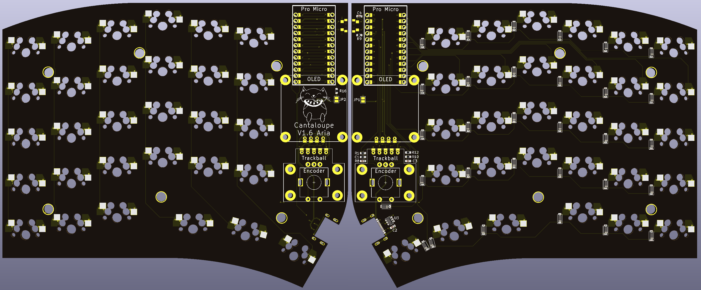
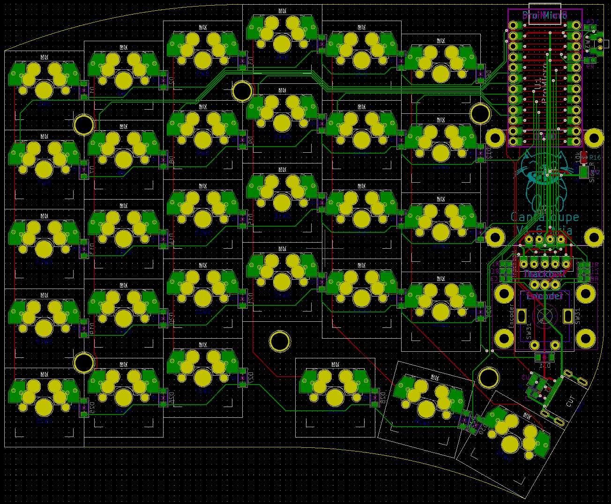

# Cantaloupe
Pro Micro version.

## Key Features
* Fully reversible pro micro slot.
* USB-C split connect port with full ESD protection.

## Changelog
* 10/2/2022: Removed PCB mounting holes. Slightly changed position of reset switch.
* 25/1/2022: Updated to V1.6. Fully reversible design, kailh hot-swap, ESD protection, 0.96" OLED, trackball and rotary encoder. 100% reversible design which means only a single board is needed for both sides. Plenty of design cues taken from the YAEMK. Pinky stagger added.
* 6/12/2021: Updated to V1.5. Added the option for OLED again. Removed Alps support. Improved switch footprints. Removed 2u support and moved rotary encoder positions. Deleted 61st and 62nd keyswitches - now has exactly 30 switches per side. Changed USB C interconnect back to TRRS and moved position.
* 1/10/2021: Added SMK support again (I'm indecisive).
* 20/7/2021: Updated to V1.4. Removed OLED support, as I don't actually care about OLED and haven't been using it with the previous prototype for a while.
* 17/5/2021: Fixed BOM and added proper OLED support.
* 2/12/2020: Changed orientation of 1u switches in thumb cluster. Updated plate to add 2u support.
* 1/12/2020: Changed OLED compatibility to 0.96" OLED. Removed Crenshaw compatibility. Removed large cutout in plate for pro micro and Crenshaw, added smaller cutout just showing screen of 0.96" OLED.
* 29/11/2020: Updated to V1.3. Added 2u switch locations in outer bottom corners and thumb cluster. Slightly increased size to allow for high-profile case options. Changed mounting holes on PCB to pass-through holes to allow for direct top and bottom plate mounting. Removed SMK switch support. Updated plate to add Alps compatibility.
* 14/11/2020: Changed USB C connector to normal from mid-mount.
* 11/11/2020: Updated to V1.2. Switch footprints changed to solder holes, compatible with MX, Alps and SMK switches. 5-way switch removed. Pro Micros flipped, facing downward, to reduce overall thickness of keyboard. Diode footprints changed to allow use of both TH and SMD (SOD-123(F) and glass DO-35) diodes.
* 7/11/2020: Fixed position of RHS screw hole and wiring of rotary encoder switch, added QMK firmware.
* 28/10/2020: Better photo, reorganized footprints, minor fixes to circuit.
* 25/10/2020: Added back 5-way switch. Removed SMK support. New renders.
* 24/10/2020: Updated to V1.1. Slightly increased stagger and different PCB shape based on the [Galia](https://github.com/Ariamelon/Galia), removed snap-away interconnect section of PCB, added ICSP header. Moved location of images folder.
* 28/09/2020: Added case files.
* 27/09/2020: Initial commit.

