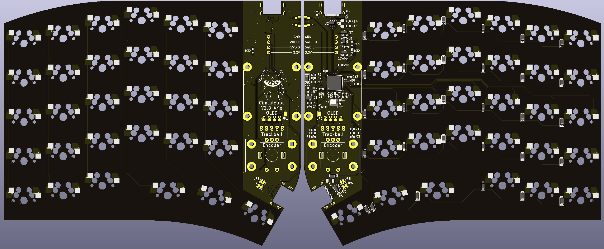
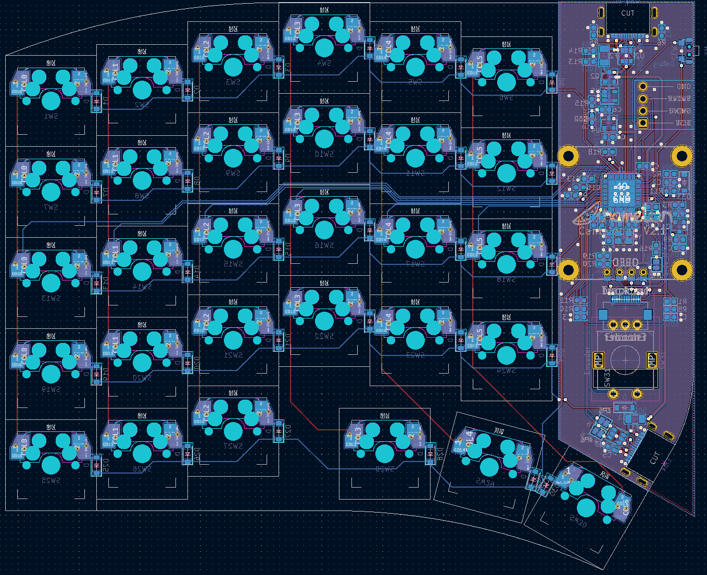
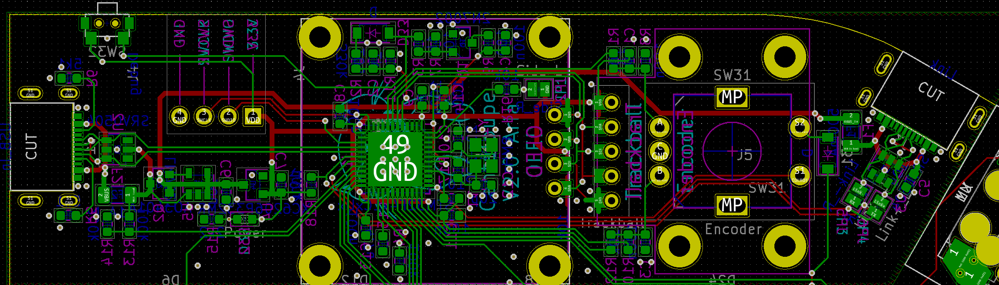
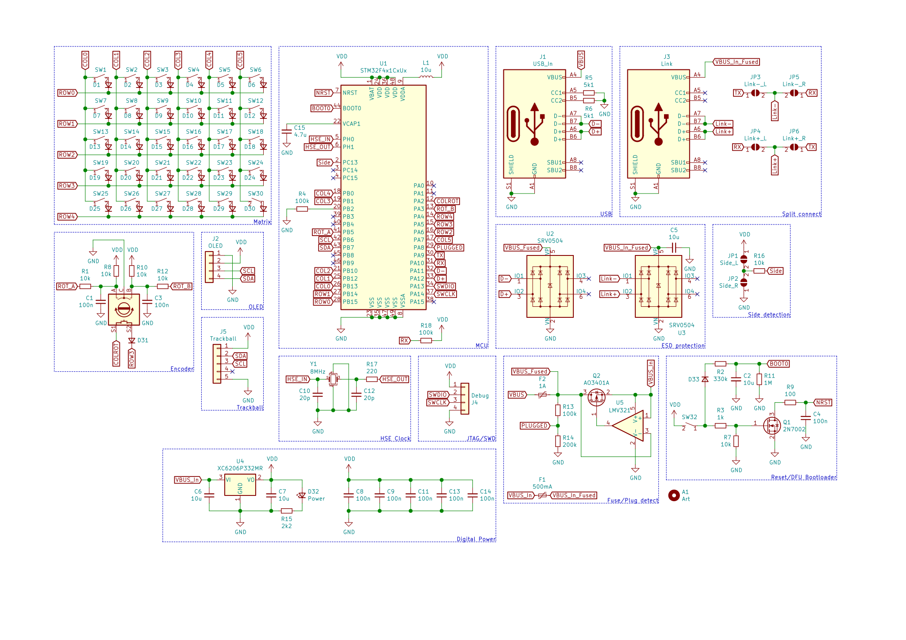

# Cantaloupe
On-board MCU version.

## Key Features
* On-board ARM STM32F4x1CxUx processor.
* USB-C input and split connect ports with full ESD protection.
* SWD breakout header for an alternate means of programming the board.

## Changelog
* 13/2/2022: Added tentative designs for CNC and 3D printed cases. 
* 11/2/2022: Clean up of design. New images. Added gerbers and files for FR4 plates.
* 9/2/2022: Changed pin assignments so B2 isn't used. Added pull-up for RX pin and pull-down for B2 pin so the keyboard can properly load into the bootloader. Changed reset circuit so it actually works. Removed USB series resistors. Removed non-functional JTAG pins. Changed SRV05-04 to SRV0504. Thanks to sigprof and MasterSpoon from the QMK discord server for the help!
* 8/2/2022: Removed holes in middle of PCB. Added top and bottom plate DXF files, as well as a tentative STEP file for a CNC case. 
* 25/1/2022: Did some rerouting, increased clearances and via size.
* 21/1/2022: Changed CPU to STM32F4x1CxUx (lets me steal them from Black Pill boards). Added plate and base gerber files. Changed BOM to reflect changes.
* 20/1/2022: Cleaned up read-me. Rearranged location of mounting holes and changed size of holes. Rerouted some traces. Cleaned up silkscreen. Added DXF files for plate and base. Changed images. Added BOM.
* 19/1/2022: New V2.0 version. On-board ARM STM32F303 processor, kailh hot-swap, ESD protection, 0.96" OLED, trackball and rotary encoder. 100% reversible design which means only a single board is needed for both sides. Plenty of design cues taken from the YAEMK. Pinky stagger added.